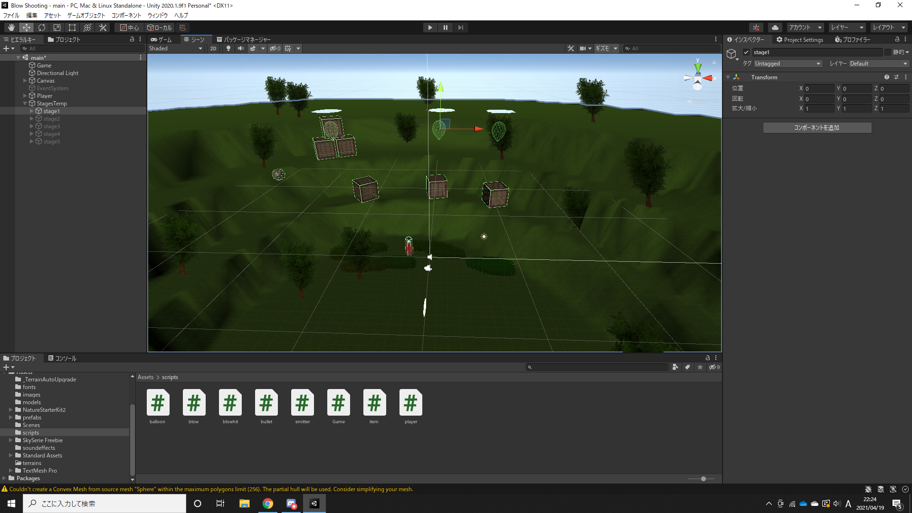
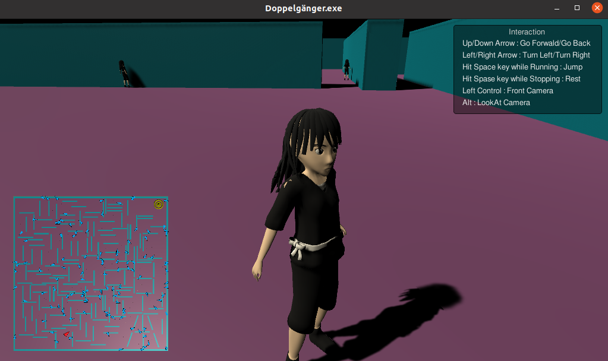
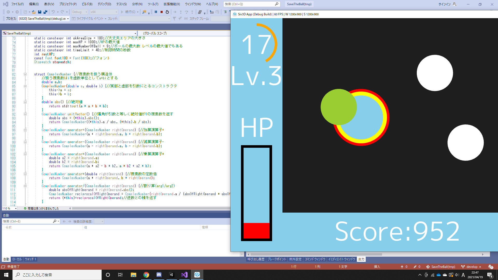
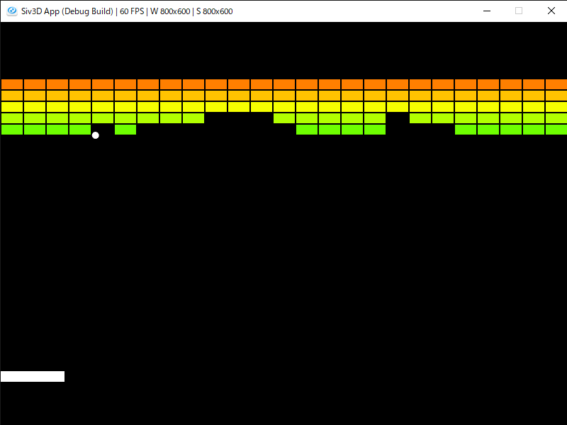

#アプリ班の活動内容
##アプリについて
アプリとは、アプリケーションソフトウェア (application software) の略で、ある目的に沿って作られたソフトウェアのことを指します。今、あなたがこのページを見ている「 Safari 」や、「 Google Chrome 」、「 Firefox 」も、アプリの一つです。

アプリの種類はネイティブアプリ、 Web アプリの2つに分けられます。ネイティブアプリは端末にインストールして使うもので、配布には「 App store 」や「 Google play 」などのアプリダウンロードサイトや、CDなどの媒体を使います。WebアプリはWebサイト自体にアプリの機能があるもので、インストールしなくてもサイトにアクセスすることで利用できます。

アプリ班では、ネイティブアプリの **2D ゲーム・ 3D ゲーム**を作っています。ネイティブアプリと言ってもアプリダウンロードサイトに上げることは少なく、文化祭ホームページ等によって外部に公開しています。**去年文化祭に向けて作ったゲームは[こちら](https://paken2020.web.app/game)で公開している**ので、是非ご覧ください。

##ゲームの製作方法
ゲームの制作には「[Unity](https://unity.com/ja)」や「[OpenSiv3D](https://siv3d.github.io/ja-jp/)」というものを使っており、それぞれ C#、 C++というプログラミング言語で動きを制御します。もともと C# や C++ ですることは計算、文字列や配列の管理などで、出力は文字です。一方でアプリ制作の場合、点や線などの図形を出力をしたり、特定の位置に文字列を出力したりする必要があります。そのため、 Unity や OpenSiv3D で使う C#、 C++の仕様は普通のものと少し違い、**アプリ制作に特化したもの**になっています。

話がそれたので、 Unity、 OpenSiv3D それぞれの入れ方と、それぞれの特徴について説明します。

###Unityの入れ方と特徴
Unity は、[このサイト](https://unity3d.com/jp/get-unity/download)から「 Unity Hub 」を入れ、ライセンスを取得した後、 Unity Hub からファイルを作ることで使うことができます。

Unity でゲームを作るときは下の画像のような画面で作業します。

Unity でゲームを作るときはすべての挙動をコードで書くのではなく、Unityの機能を使って物体を置いた後に、必要ならば C# のコードを充てます。そのため、**全くコードが書けない人でも使ってみることが出来ます。**プログラミングを全く知らない人も、Unityを使いながら学んでいくことが出来るでしょう。

一方で、 Unity には数多くの機能があります。物理演算、アニメーション、ライティング(光を当てること)、・・・挙げていけばキリがありません。**無料で使える** Unity ですが、それらをうまく使いこなせれば**とてもレベルが高いものも作れます。**Unityはさっき言ったように敷居が低いので、とりあえず触ってみてはいかがでしょうか。

参考までに、去年の文化祭で作ったゲームの中でUnityを使ったのは、「[BlowShooting](https://paken2020.web.app/game/blow)」・「[infinity run](https://paken2020.web.app/game/infinity)」・「[Maze](https://paken2020.web.app/game/maze)」・「[Doppelgänger](https://paken2020.web.app/game/doppel)」(下画像)・「[TK_FPS](https://paken2020.web.app/game/tkfps)」・「[fps game](https://paken2020.web.app/game/fpsgame)」です。

###OpenSiv3Dの入れ方と特徴
Open siv3D を使うには、 Windows 環境では「 Visual Studio 」、 MacOS 環境では「 Xcode 」というエディタを入れたのち、[このサイト](https://siv3d.github.io/ja-jp/#opensiv3d-sdk-v043)に従ってOpenSiv3Dをインストールします。 Ubuntu などの Linux 環境では、[このサイト](https://github.com/Siv3D/OpenSiv3D/blob/master/Linux/README_JP.md)に従って「 Open siv3D Linux版」をソースコードからビルドすることで使うことができます。

OpenSiv3D は Unity と違い、図形の表示などすべての処理を C++ のコードによって行います。**すべてがコードの中で完結する**ので、 Unity よりわかりやすいという人もいるでしょう。作業画面は下の画像のような感じです。(左半分がコードを書くエディタで、右半分はテストプレイのウィンドウです)

OpenSiv3Dの利点として、他には「競プロで主に使うのと同じ C++ を使うので、**競プロと並行してやりやすい/競プロの片手間にチャレンジできる**」というものや、「公式のチュートリアルが充実しているので**勉強しやすい**」というのがあります。興味を持った方は[こちらの公式チュートリアル](https://siv3d.github.io/ja-jp/tutorial/basic/)を覗いてみて下さい。

参考までに、去年の文化祭で作ったゲームの中でOpenSiv3Dを使ったのは、「[ピコピコハンマー](https://paken2020.web.app/game/pikohammer)」・「[ブロック崩し](https://paken2020.web.app/game/block)」(下画像)・「[Convex Hull Visualizer](https://paken2020.web.app/game/convex)」・「[CrammingGame2.1.1](https://paken2020.web.app/game/cramming)」です。

##終わりに
アプリ制作に少しでも興味が湧いた人は、是非アプリ班に入ってください！

文責：樋口 峻大 (TAKA)、nuhunune
