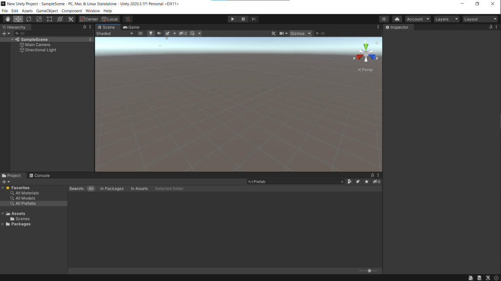

#アプリ班の活動内容
##アプリについて
アプリとは、アプリケーションソフトウェア (application software) の略で、ある目的に沿って作られたソフトウェアのことを指します。今、あなたがこのページを見ている「 Safari 」や、「 Google Chrome 」、「 Firefox 」も、アプリの一つです。

アプリの種類はネイティブアプリ、 Web アプリの2つに分けられます。ネイティブアプリは、「 App store 」や「 Google play 」などのアプリダウンロードサイトを経由してアプリを配布し、ユーザーはダウンロードすることで利用できます。Webアプリは、ブラウザ上で動き、サイトにアクセスすることで利用できます。
##ゲームの製作方法
アプリ班では、ネイティブアプリの 2D ゲーム、 3D ゲームを「 Unity 」や「 Opensiv3D 」を使って作っています。ネイティブアプリとは言っても、アプリダウンロードサイトに上げることは少なく (おそらくない) 、パ研の文化祭ホームページ等によって外部に公開されます。

Unity は C# 、 Open siv3D は C++ と呼ばれる言語でゲームを制作することができます。もともと C# や C++ は計算、文字列や配列の管理をしていて、出力は文字ですが、アプリ制作の場合、点や線などの図形を出力をしたり、特定の位置に文字列を出力したりする必要があります。そのため、 Unity や Open siv3D で使われている言語は普通の C# , C++ とは少し違った言語仕様で作られています。話がそれたので、 Unity, Open siv3D のそれぞれの簡単な入れ方の説明と特徴について説明します。

Unity は、「 Unity Hub 」を入れ、ライセンスを取得後、 Unity Hub からファイルを作ることで使うことはできます。Unityでゲームを作るときは下の画像のような場所でゲームを作ります。

基本的にコードでゲームを制御しますが、図形をパソコンからアップロードすることも可能です。

Open siv3D は、 Windows 環境では「 Visual Studio 」と Open siv3D 、 MacOS 環境では「 Xcode 」と Open siv3D を入れることで、 Linux 環境では「 Open siv3D Linux版」をソースコードからビルドすることで使うことができます。Open siv3D はほとんどが C++ のコードによってゲームを制御します。
#終わりに
アプリ制作に少しでも興味が湧いた人は、是非アプリ班に入ってください！

文責：樋口 峻大 (TAKA)
