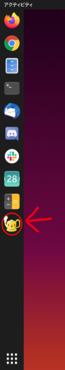
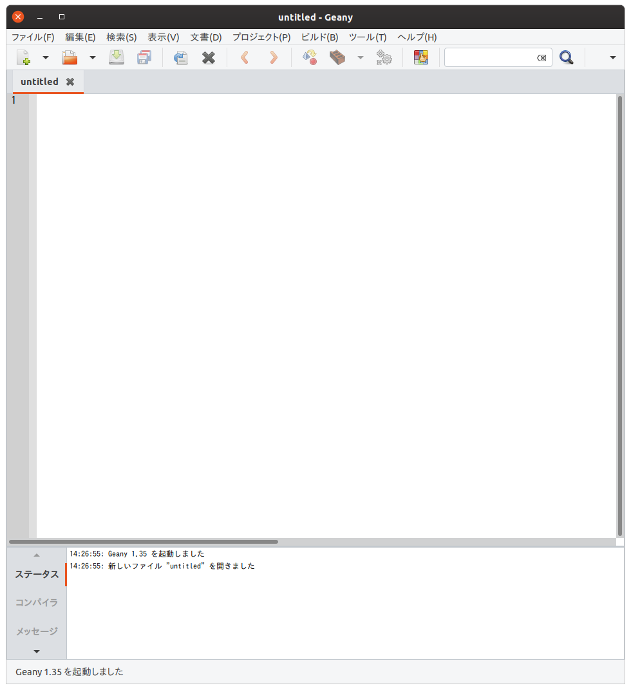
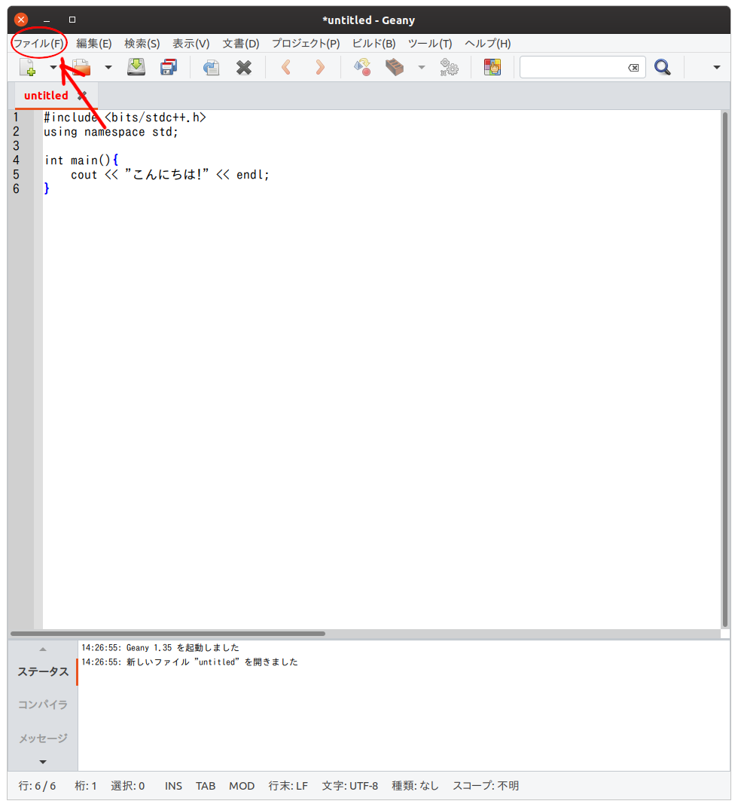
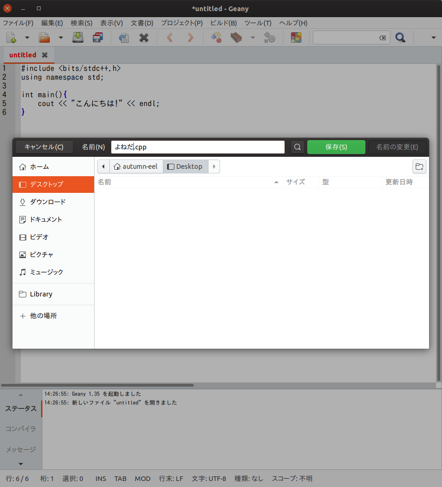
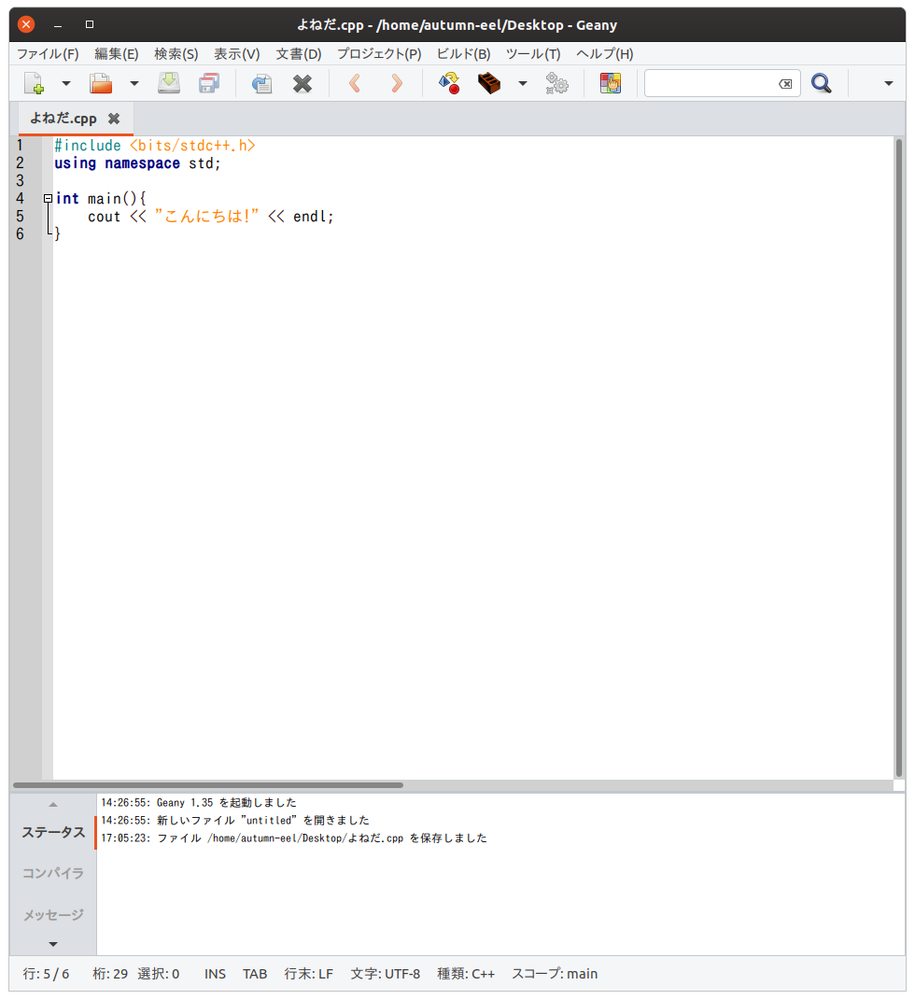
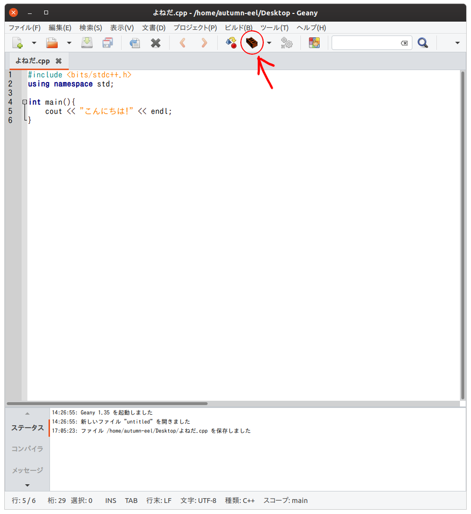
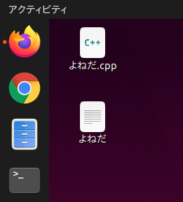
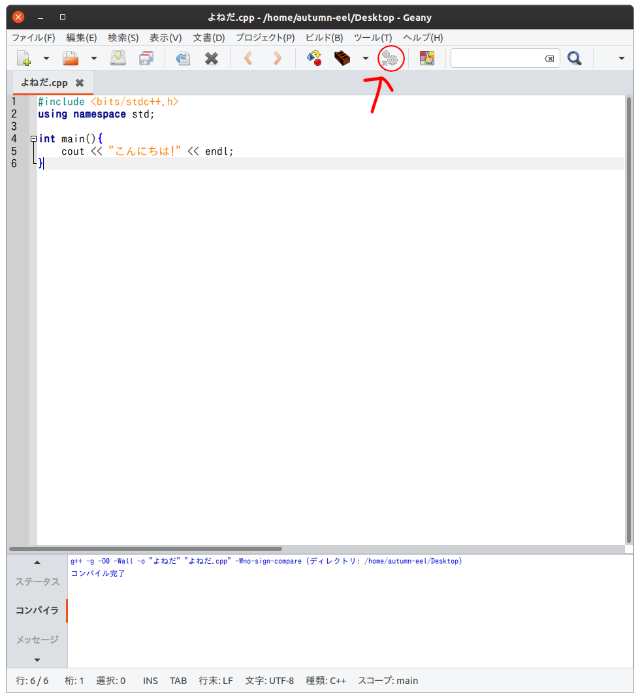
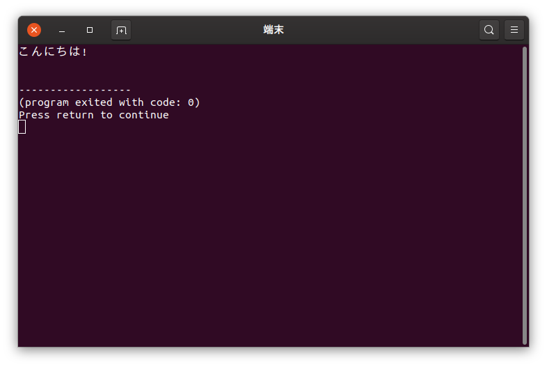

# 第3章 - 本格的なプログラムを書いてみよう! (準備編)

第2章でみなさんは簡単なプログラムを書き、パソコンに色々な計算をさせるということをしました。

これからもっと本格的なプログラミングを始めていくのですが、基本は2章でやったことと全く同じで、そんなに心配する必要はありません。

これから学んでいくのは「**C++**」というプログラミング言語です。第2章で勉強した JavaScript とはちょっと違うのですが、今は違いをそこまで気にする必要はありません。

まずこのページでは、プログラムを作成するまでの準備について紹介します。


## 準備

さて、今までみなさんは、こんな感じでプログラムを一行ずつ書きながら実行していたと思います。

```
> a = 5;
5
> b = 3;
3
> a + b;
8
```

この方法は何が起きているか分かりやすいという点でとても便利なのですが、もっと大きなプログラムを書く場合を想像してみてください。

もし一個間違ったプログラムを書いてしまったら、それを元に戻すことはできません。全部最初からやり直すことになるのです。さらには、同じプログラムを何回も実行したい場合、そのたびにプログラムを書き直す必要があります。

これでは大変ですね。

そこで出てくるのが、「ファイル」という概念です。

小学校の時に学校の授業や家でWordの文書やPower Pointのスライドといったものを作ったことがある人も多いと思います。あれらは全て「ファイル」という形でパソコン上に保管(保存)されています。あんな感じでプログラムを保管して、何度も書き直したり、実行したりできるようにしようということです。


文章を書くときにWordを使ったり、スライドを作る時にPowerPointを使ったりするように、プログラムを書く時に使うソフトというものがあります。これには色々な種類があるのですが、パ研では **Geany** というソフトを使います。早速起動してみましょう。 

<br><br>

***

...と言いたいところですが、多分今これを読んでいる人は残念ながらパ研に来ることができていないと思います。

この説明は、パ研のパソコンを使う場合のやり方なので、家のパソコンでは使えない人が多いはずです。

そこで、家でプログラムを書くための方法について次のページで説明するので、とりあえず下を一通り読んで「プログラムを実行する」ということがどんな感じかイメージを掴んでから、次のページに進んでください。

***

<br><br>


画面の左側にある黄色いヤカンのようなアイコンをクリックしてください。



するとこのようなものが表示されるはずです。これがGeanyの画面です。



ここに下のプログラムをコピーして貼り付けてみてください(中身については今は分からなくて良いです)。

コピーはプログラムの部分を選択した後右クリック→コピーで、貼り付けはGeanyの画面で右クリック→貼り付けでできます。

```cpp
#include <bits/stdc++.h>
using namespace std;

int main(){
    cout << "こんにちは!" << endl;
}
```

このプログラムを保存してみましょう。



左上の「ファイル」メニューから「保存」を選ぶと、このような保存画面が表示されるはずです。

左側から保存先として「デスクトップ」を選んだあと、ファイルの名前を `[自分の名前].cpp` にして保存ボタンを押して下さい (名前は漢字でもカタカナでもローマ字でもOKです)。もし同じ名前の人が既にファイルを作っていたら、自分の名前の後に適当な数字をつけてください。

「.cpp」というのは **拡張子** と言って、「これはC++のプログラムファイルだよ」ということをGeanyなどのソフトに教えるためのものです。




これでプログラムをファイルに保存することができました!

プログラムにカラフルな色が付いていますね。これは拡張子のおかげでGeanyによって「このファイルはC++のプログラムを書いたものだ」ということが認識されたからです。(色が付いていない人は、どこかで手順を間違えているので声を掛けてください)。



プログラムを保存できたところで、これを実行してみましょう。

上真ん中のところに茶色い箱のようなアイコンがありますね。まずこれを押してみて下さい。



何も起こらなかった、と思ったかもしれませんが、実は今ボタンを押したときパソコンはものすごい量の仕事をしていました。

これまで説明を省いてきていたのですが、実はC++などのプログラミング言語で書かれたプログラムをパソコンが直接理解することはできません。このプログラムを実行するには、まずパソコンが理解できる **機械語** に翻訳する必要があります。

今ボタンを押した時に起こったのはその翻訳などの作業で、これによってパソコンの理解出来る **実行ファイル** が作成されたのです。この手順を **ビルド** と言います。2章の時にこの手順が必要なかったのは、一行入力するごとにこれが自動で行われていたからです。

実際に翻訳されたファイルができているか確認してみましょう。Geanyの画面をちょっと動かして、デスクトップの画面をみてください。みなさんが書いた```[自分の名前].cpp``` の他に、`[自分の名前]`というファイルが作られていると思います。これが機械語のファイルです。これをGeanyなどのソフトで直接編集することはできません。



実行ファイルができたところで、いよいよ実行をしてみましょう。

さっき押したボタンのとなりにある、歯車のボタンを押して下さい。



プログラムを実行することができました!

このプログラムは、「こんにちは!」という文字を画面に出力する、というプログラムだったんですね。

「こんにちは!」の後に (program exited with code: 0) というメッセージが出ていますが、これは「プログラムが正常に終了した」という意味だと思ってもらえれば良いです。

この実行画面はEnterキーを押して閉じることができます。



ここまでプログラムを書いたファイルの作成から実行まで、ざっと説明をしてきました。

次のページではいよいよプログラムの中身について学んでいきます。

といっても、これに関してはとても良くできた教材があるのでその紹介が中心になるのですが...

もし疑問に思ったことがあったり、どこかでうまくいかなかったりしたら気軽に質問をしてくださいね。

# ここまでできたら、[本編](./apg4b) に進んでみましょう！