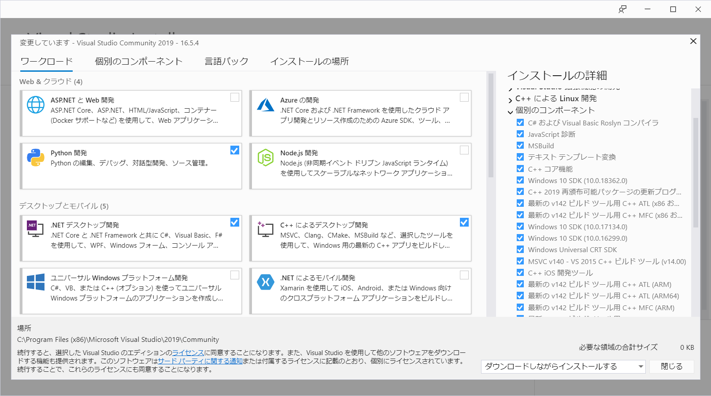
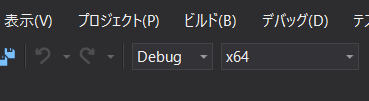
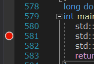
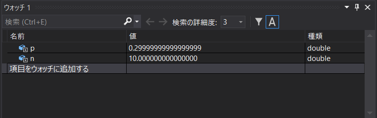

# Windowsでの環境構築(Visual Studioの場合)

## Visual Studioのインストール
Visual Studioはパ研の環境とは違いますが、Windowsで使える強力なIDE(統合開発環境)です。
デバッグ機能が充実しており、バグを直したりメモリ量を測定したりするのには非常に便利です。
**以下の作業は管理者権限のあるアカウントで行ってください。**

### インストール手順
[公式サイト](https://visualstudio.microsoft.com/ja/downloads/)から、Visual Studio Communityをダウンロードします。
有料版もありますが、無料のCommunityで十分です。
インストーラーがダウンロードできたら、インストーラーを開き、インストールに進みましょう。
画面の指示に沿って進んでいってください。
途中で、次のような、機能を選択する画面が出てくると思います。

"C++によるデスクトップ開発"を選んでおけばC++での開発はできますが、他にも入れたいものがあればチェックを入れましょう。
ただし、Xamarinなど、ストレージを大量に消費するものもあります。
ひとまず競技プログラミングのような、素のC++コードの実行だけがしたい場合は、"C++によるデスクトップ開発"だけで十分でしょう。
インストールには多少時間がかかるので、気長に待ちましょう。
これでインストールは完了です。

## 使い方
使い方を説明します。
Visual Studioを開いたら、"新しいプロジェクトの作成"をクリックし、"空のプロジェクト(C++)"を作ってください。
この状態ではコーディングできるファイルが存在しないので、コードを書くためのファイルをプロジェクトに追加します。
"表示"タブからソリューションエクスプローラーを開き、"ソースファイル"を右クリックして、"追加"→"新しい項目"と進みます。
"C++ファイル"を選んで追加しましょう。これで、パ研などと同じようにコーディングができます。
実行はF5ボタン、ビルドのみはCtrl+Shift+Bボタンでできます。

### デバッグ
Visual Studioの最も重要な機能の一つが、デバッグです。
デバッグの基本的な方法を説明します。
まずは、ソリューション構成を"Debug"に設定します。バグがないとわかっているときは"Release"にするといいでしょう。

次に、コードの中で実行途中に"ブレークポイント"を設定します。
次のように、行の左側をクリックすると設定できます。

このまま実行すると、それぞれのブレークポイントで実行が止まります。
そこで、次のように変数の値を確認することができます。

このように、変数の値を確認するなどの操作を活用して、バグの発見を容易にしましょう。